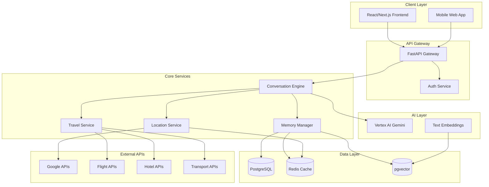
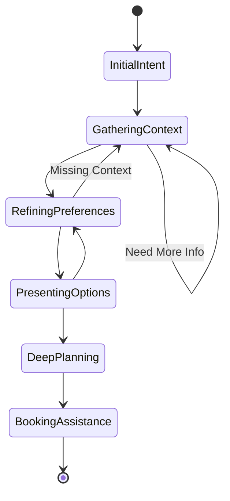
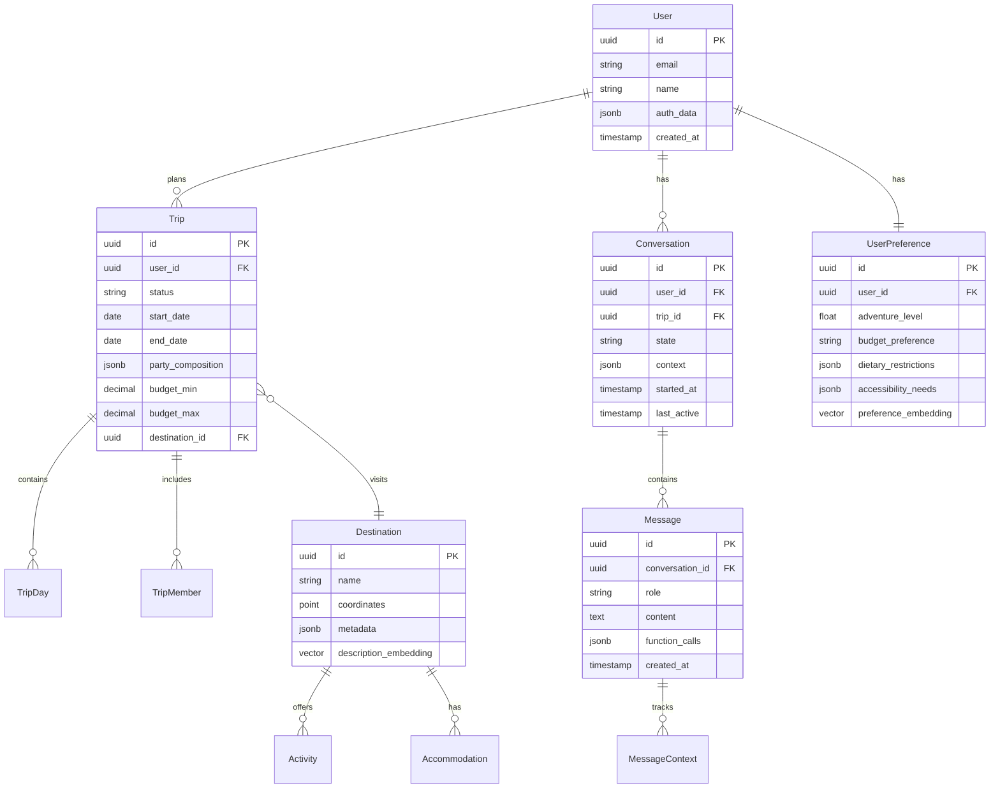
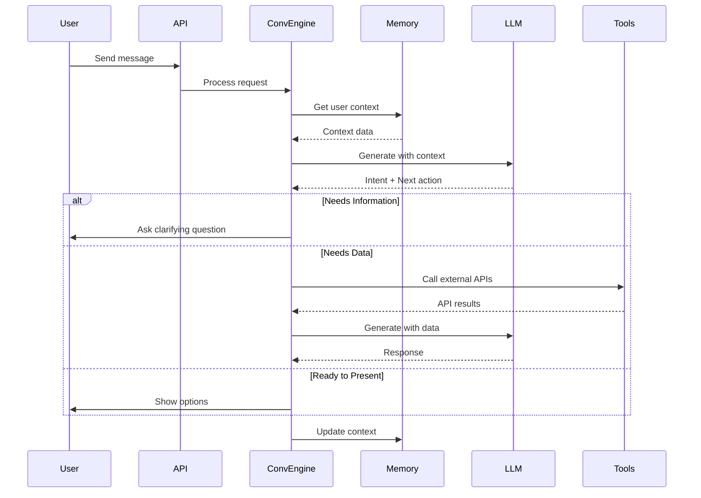
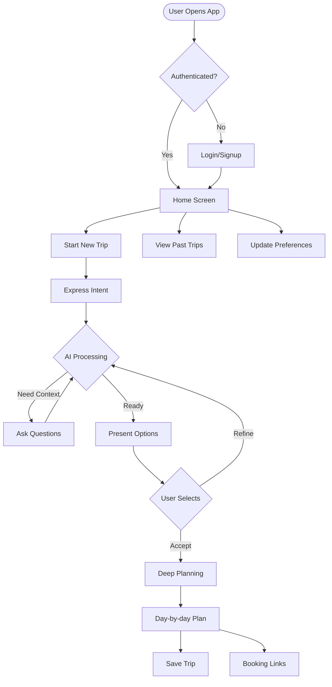
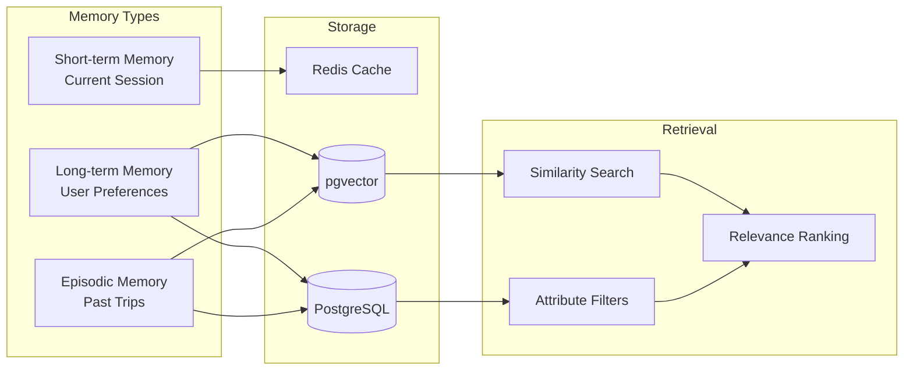
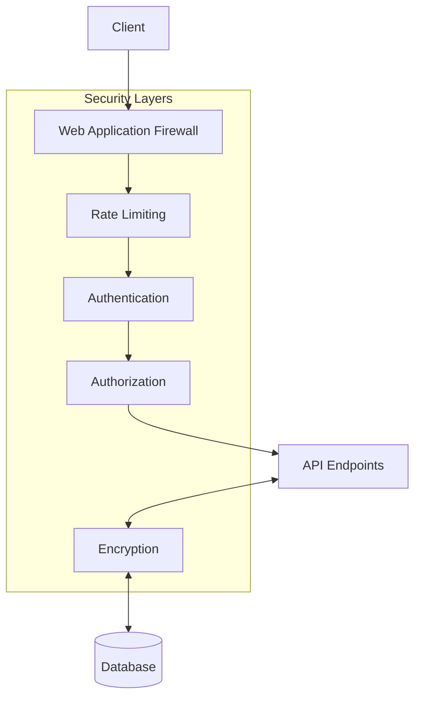
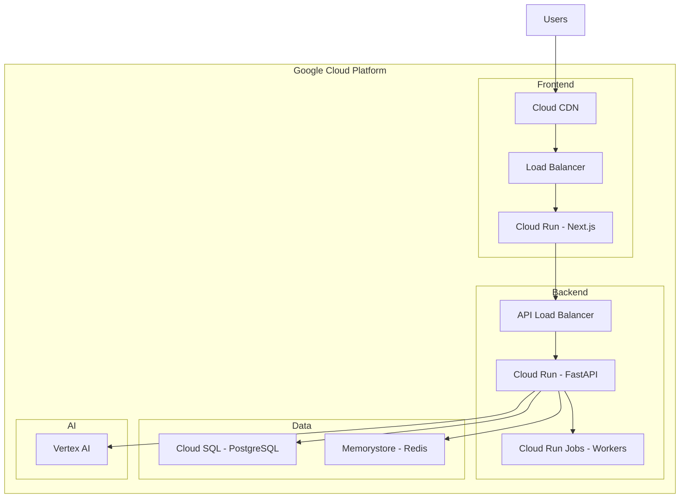

# PickedFor.me Architecture Documentation

## System Architecture Overview



## Conversation Engine Architecture



## Data Schema



## Conversation Flow Implementation



## Application Workflow



## Memory Architecture



## API Structure

```yaml
/api/v1/:
  /auth:
    POST /login
    POST /logout
    GET /me
    
  /conversations:
    POST /start
    GET /{conversation_id}
    POST /{conversation_id}/message
    
  /trips:
    GET /
    GET /{trip_id}
    POST /
    PUT /{trip_id}
    
  /destinations:
    GET /search
    GET /{destination_id}
    GET /{destination_id}/activities
    
  /users:
    GET /preferences
    PUT /preferences
    GET /history
```

## Security Architecture



## Deployment Architecture

