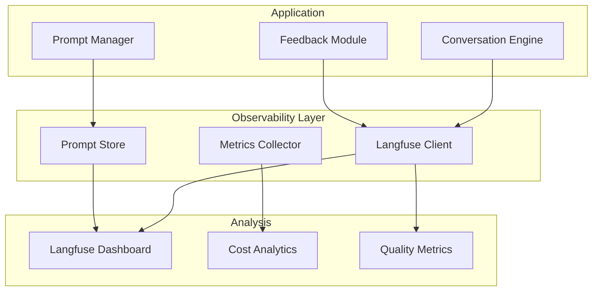

# LLM Observability & Prompt Management Strategy

## Overview

For a travel planning app with conversational AI, observability is critical for:
- Understanding conversation quality
- Debugging failed interactions
- Optimizing prompts based on real usage
- Tracking costs across different models
- Identifying edge cases and improving them

## Recommended Solution: Langfuse

**Langfuse** is the best fit for this project because:
- **Free tier**: 50k observations/month (plenty for MVP)
- **Open source** with self-host option for scale
- **Native PydanticAI integration** 
- **Excellent Vertex AI support**
- **Built-in prompt management**

## Alternative Options Comparison

| Feature | Langfuse | LangSmith | Helicone | Phoenix | Custom |
|---------|----------|-----------|----------|---------|---------|
| Free Tier | 50k/month | 5k/month | 100k/month | Unlimited | N/A |
| Prompt Management | ✅ | ✅ | ❌ | ❌ | Build |
| PydanticAI Support | ✅ | Via OpenTelemetry | ✅ | ✅ | Build |
| Vertex AI Support | ✅ | ✅ | ✅ | ✅ | Build |
| Self-host Option | ✅ | ❌ | ❌ | ✅ | ✅ |
| Cost Analytics | ✅ | ✅ | ✅ | Basic | Build |
| User Feedback | ✅ | ✅ | ❌ | ❌ | Build |

## Implementation Architecture



## Integration Implementation

### 1. Basic Setup

```python
from langfuse import Langfuse
from langfuse.decorators import observe, langfuse_context
from pydantic_ai import Agent
import vertexai

# Initialize Langfuse
langfuse = Langfuse(
    public_key="pk-lf-...",
    secret_key="sk-lf-...",
    host="https://cloud.langfuse.com"  # or self-hosted URL
)

# Wrap PydanticAI agents
class ObservableAgent:
    def __init__(self, agent: Agent, name: str):
        self.agent = agent
        self.name = name
    
    @observe(name="agent_call")
    async def run(self, prompt: str, **kwargs):
        # Automatic tracing of:
        # - Input/output
        # - Model used
        # - Token usage
        # - Latency
        # - Errors
        return await self.agent.run(prompt, **kwargs)
```

### 2. Prompt Management System

```python
class PromptManager:
    def __init__(self, langfuse: Langfuse):
        self.langfuse = langfuse
        self.cache = {}
    
    async def get_prompt(
        self, 
        name: str, 
        version: Optional[str] = None
    ) -> str:
        """Fetch prompt from Langfuse with versioning"""
        prompt = self.langfuse.get_prompt(
            name=name,
            version=version or "latest"
        )
        
        # Track prompt usage
        langfuse_context.update_current_trace(
            metadata={"prompt_name": name, "prompt_version": prompt.version}
        )
        
        return prompt.compile()
    
    async def test_prompt_variant(
        self,
        name: str,
        test_cases: List[Dict]
    ) -> PromptTestResults:
        """A/B test different prompt versions"""
        variants = self.langfuse.get_prompt_variants(name)
        
        results = []
        for variant in variants:
            for test_case in test_cases:
                result = await self.evaluate_prompt(
                    variant,
                    test_case
                )
                results.append(result)
        
        return PromptTestResults(results)

# Prompt templates stored in Langfuse
INTENT_EXTRACTION_PROMPT = await prompt_manager.get_prompt("intent_extraction")
CONTEXT_GATHERING_PROMPT = await prompt_manager.get_prompt("context_gathering")
TRIP_PLANNING_PROMPT = await prompt_manager.get_prompt("trip_planning")
```

### 3. Conversation Tracking

```python
class ConversationTracker:
    @observe(name="conversation_turn")
    async def process_message(
        self,
        message: str,
        conversation_id: str,
        user_id: str
    ):
        # Add conversation metadata
        langfuse_context.update_current_trace(
            user_id=user_id,
            session_id=conversation_id,
            metadata={
                "conversation_state": self.state,
                "turn_number": self.turn_count,
                "user_context": self.get_user_context()
            }
        )
        
        # Process with tracking
        response = await self.conversation_engine.process(message)
        
        # Track user feedback
        if response.requires_feedback:
            langfuse_context.score_current_trace(
                name="user_satisfaction",
                value=response.satisfaction_score
            )
        
        return response
```

### 4. Quality Metrics

```python
class QualityMonitor:
    def __init__(self):
        self.metrics = {
            'response_relevance': self.check_relevance,
            'completion_rate': self.check_completion,
            'error_rate': self.check_errors,
            'user_satisfaction': self.check_satisfaction
        }
    
    @observe(name="quality_check")
    async def evaluate_conversation(
        self,
        conversation: Conversation
    ):
        scores = {}
        
        for metric_name, metric_fn in self.metrics.items():
            score = await metric_fn(conversation)
            
            langfuse_context.score_current_trace(
                name=metric_name,
                value=score,
                comment=f"Auto-evaluated {metric_name}"
            )
            
            scores[metric_name] = score
        
        # Flag problematic conversations
        if any(score < 0.7 for score in scores.values()):
            langfuse_context.update_current_trace(
                tags=["needs_review"],
                metadata={"scores": scores}
            )
        
        return scores
```

### 5. Cost Tracking

```python
class CostTracker:
    # Model pricing (example rates)
    PRICING = {
        'gemini-2.0-flash': {'input': 0.075, 'output': 0.30},    # per 1M tokens
        'gemini-2.5-flash': {'input': 0.15, 'output': 0.60},
        'gemini-2.5-pro': {'input': 1.25, 'output': 5.00}
    }
    
    @observe(name="cost_tracking")
    async def track_request_cost(
        self,
        model: str,
        input_tokens: int,
        output_tokens: int
    ):
        cost = self.calculate_cost(model, input_tokens, output_tokens)
        
        langfuse_context.update_current_trace(
            metadata={
                "model": model,
                "input_tokens": input_tokens,
                "output_tokens": output_tokens,
                "cost_usd": cost
            },
            tags=[f"model:{model}"]
        )
        
        return cost
```

### 6. Error Tracking & Recovery

```python
class ErrorHandler:
    @observe(name="error_handling")
    async def handle_conversation_error(
        self,
        error: Exception,
        context: ConversationContext
    ):
        # Log error details
        langfuse_context.update_current_trace(
            level="ERROR",
            status_message=str(error),
            metadata={
                "error_type": type(error).__name__,
                "conversation_state": context.state,
                "recovery_attempted": True
            }
        )
        
        # Attempt recovery
        recovery_response = await self.attempt_recovery(error, context)
        
        # Track recovery success
        langfuse_context.score_current_trace(
            name="error_recovery",
            value=1.0 if recovery_response.successful else 0.0
        )
        
        return recovery_response
```

### 7. User Feedback Integration

```python
class FeedbackCollector:
    async def collect_feedback(
        self,
        conversation_id: str,
        component_id: str,
        feedback_type: str,
        value: Any
    ):
        # Link feedback to specific generation
        trace = langfuse.score(
            trace_id=conversation_id,
            name=feedback_type,
            value=value,
            comment=f"User feedback on {component_id}"
        )
        
        # Use feedback for prompt improvement
        if feedback_type == "component_relevance" and value < 0.5:
            await self.flag_for_prompt_review(
                component_id,
                conversation_id,
                reason="Low relevance score"
            )
```

## Dashboard Configuration

### Key Metrics to Track

1. **Conversation Metrics**
   - Success rate (completed trips)
   - Average turns to completion
   - Drop-off points
   - Error rates by state

2. **Model Performance**
   - Latency by model
   - Cost per conversation
   - Token usage patterns
   - Function call success rates

3. **User Satisfaction**
   - Component selection rates
   - Veto patterns
   - Swap frequency
   - Overall trip satisfaction

4. **Prompt Performance**
   - A/B test results
   - Version performance
   - Edge case handling
   - Error rates by prompt

### Alert Configuration

```python
# Langfuse alert rules
alerts = [
    {
        "name": "high_error_rate",
        "condition": "error_rate > 0.05",
        "action": "notify_engineering"
    },
    {
        "name": "slow_response",
        "condition": "p95_latency > 5000ms",
        "action": "check_model_performance"
    },
    {
        "name": "low_satisfaction",
        "condition": "satisfaction_score < 0.7",
        "action": "review_conversation"
    }
]
```

## Implementation Priority

1. **Phase 1 (MVP)**
   - Basic Langfuse integration
   - Error tracking
   - Cost monitoring
   - Simple dashboards

2. **Phase 2 (Optimization)**
   - Prompt versioning
   - A/B testing
   - Quality metrics
   - User feedback loop

3. **Phase 3 (Scale)**
   - Self-hosted deployment
   - Custom analytics
   - ML-based prompt optimization
   - Automated quality improvement

## Benefits

1. **Debugging**: Full conversation traces for troubleshooting
2. **Optimization**: Data-driven prompt improvements
3. **Cost Control**: Real-time cost monitoring and alerts
4. **Quality**: Automated quality checks and monitoring
5. **Learning**: Continuous improvement from user feedback

This observability setup ensures you can maintain high-quality conversations while keeping costs under control and continuously improving the user experience.